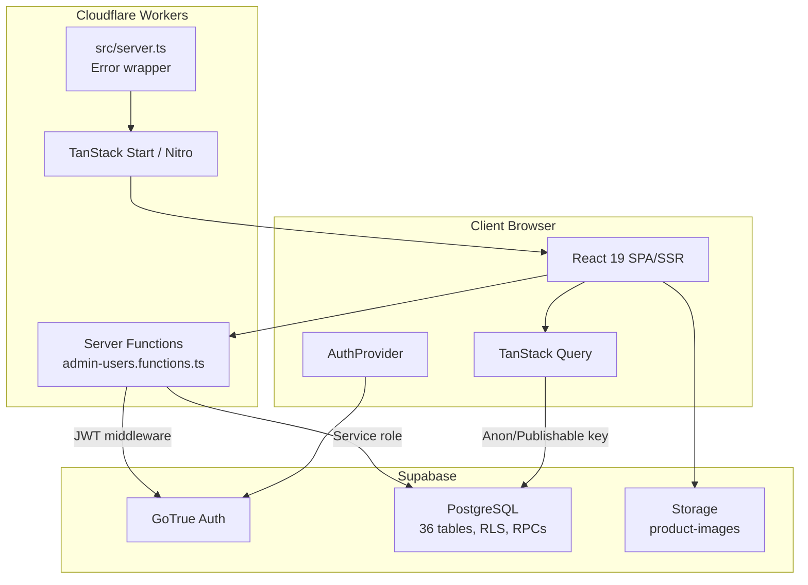
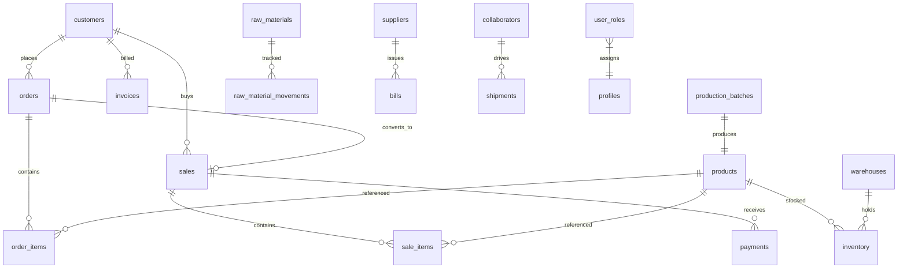
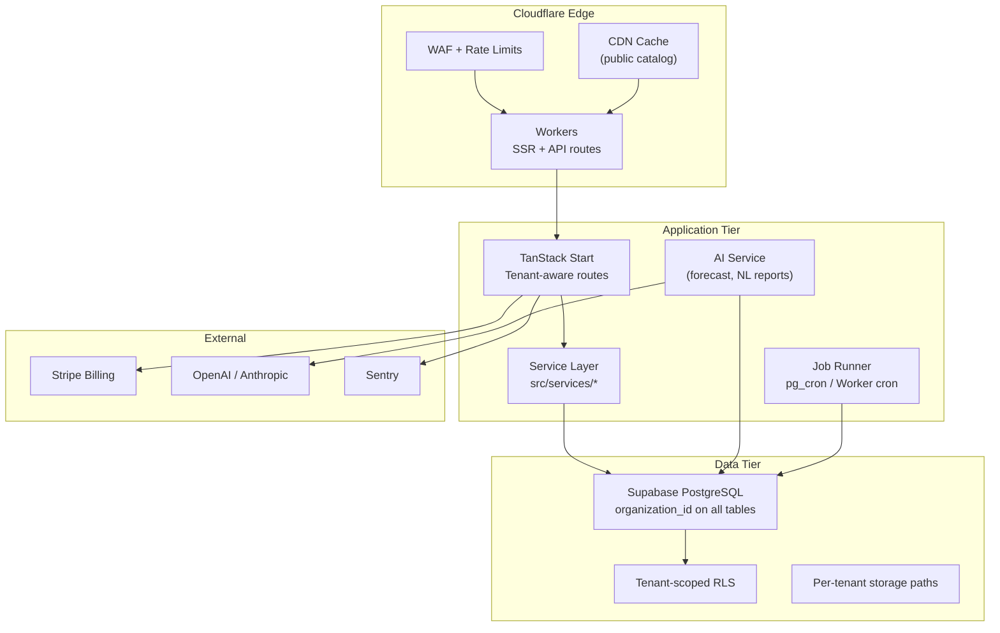
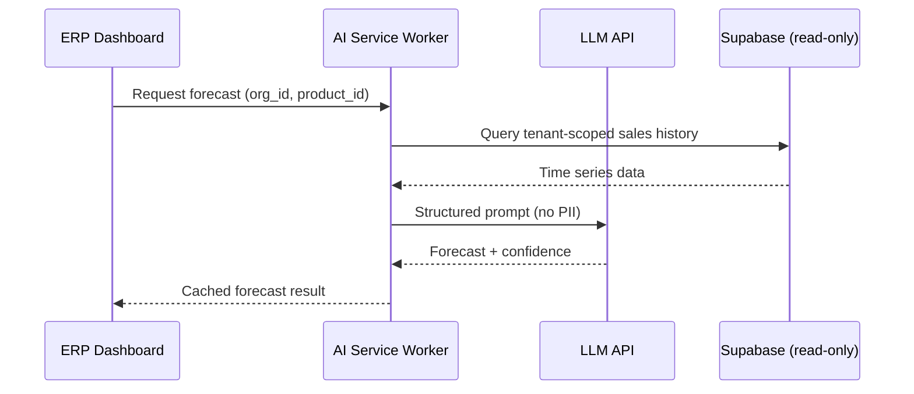
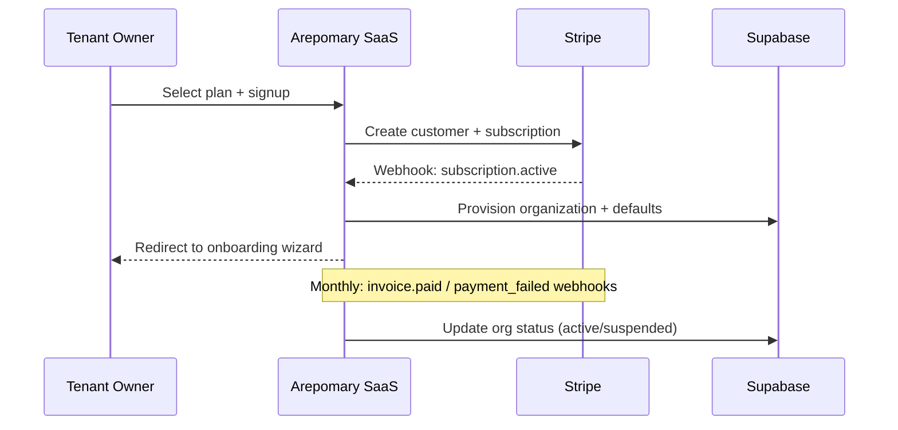

# Architecture Document

**Product:** Arepomary SaaS  
**Version:** 1.0  
**Date:** June 19, 2026  
**Status:** Draft — Current State + Target SaaS Architecture

---

## 1. Purpose

This document describes the **current architecture** of Arepomary ERP and the **target architecture** required for commercial multi-tenant SaaS. It serves as the technical reference for engineering decisions across all roadmap phases.

---

## 2. Architecture Principles

| Principle | Description |
|-----------|-------------|
| **Database as source of truth** | Business invariants enforced in PostgreSQL (RLS, triggers, RPCs) |
| **Defense in depth** | UI RBAC + RLS + server function auth |
| **Tenant isolation first** | No feature ships without verified tenant boundaries |
| **Edge-first delivery** | SSR on Cloudflare; cache public reads at edge |
| **Progressive extraction** | Move logic to services incrementally, not big-bang rewrite |
| **Colombia-first, locale-ready** | COP, es-CO, local payment methods; i18n hooks for LATAM |

---

## 3. Current State Architecture (As-Is)

### 3.1 System Context

```mermaid
C4Context
    title Arepomary ERP — Current Context

    Person(guest, "Guest Customer", "Places orders without login")
    Person(staff, "Staff User", "Admin, seller, logistics, operations")
    Person(customer, "Registered Customer", "Portal access")

    System(arepomary, "Arepomary ERP", "TanStack Start on Cloudflare Workers")
    System_Ext(supabase, "Supabase", "Auth, PostgreSQL, Storage, RPC")
    System_Ext(cloudflare, "Cloudflare", "CDN, Workers, WAF")
    System_Ext(fonts, "Google Fonts", "Typography CDN")

    guest --> arepomary
    staff --> arepomary
    customer --> arepomary
    arepomary --> supabase
    arepomary --> cloudflare
    arepomary --> fonts
```

### 3.2 Container Diagram (Current)



### 3.3 Application Layers

| Layer | Location | Responsibility |
|-------|----------|----------------|
| **Routes / Pages** | `src/routes/*.tsx` | UI, forms, TanStack Query hooks, direct Supabase calls |
| **Components** | `src/components/` | App shell, shared UI, shadcn primitives |
| **Hooks** | `src/hooks/` | Auth context, mobile detection |
| **Lib** | `src/lib/` | RBAC, export, phone validation, production profit, admin server fns |
| **Integrations** | `src/integrations/supabase/` | Client, server admin, auth middleware, generated types |
| **Database** | `supabase/migrations/` | Schema, RLS, triggers, RPC functions |

### 3.4 Request Flows

#### Authenticated ERP read/write

```
Browser → Supabase JS client (JWT in localStorage)
       → PostgREST → RLS policy check → PostgreSQL
```

#### Server function (admin operations)

```
Browser → attachSupabaseAuth middleware (Bearer token)
       → requireSupabaseAuth (JWT validation)
       → assertAdmin(userId) via service role
       → supabaseAdmin.auth.admin.* 
```

#### Guest order (anonymous)

```
Browser → Supabase anon key
       → rpc('create_guest_order', ...) SECURITY DEFINER
       → Creates customer + order + items atomically
```

### 3.5 Authentication & Authorization

| Concern | Implementation |
|---------|----------------|
| Identity | Supabase Auth (email/password) |
| Session | JWT in localStorage; auto-refresh |
| Roles | `user_roles` table; loaded in `AuthProvider` |
| UI authorization | `src/lib/rbac.ts` — `MODULES`, `ROLE_ACCESS`, `canAccessPath()` |
| Data authorization | PostgreSQL RLS via `has_role()`, `is_staff()` |
| Seller scoping | `isSellerScoped()` + RLS seller_id policies |
| Server admin ops | Service role in `client.server.ts` (3 functions only) |

### 3.6 Data Model Summary

**36 tables** in `public` schema. Key entity relationships:



**Database functions:** 20+ RPCs including `create_guest_order`, `convert_order_to_sale`, `pay_seller_commissions`, recalc triggers.

### 3.7 Deployment Topology

| Component | Target |
|-----------|--------|
| Application | Cloudflare Workers (`wrangler.jsonc`, `src/server.ts`) |
| Build | Vite 7 + `@lovable.dev/vite-tanstack-config` |
| Database | Supabase hosted PostgreSQL |
| Assets | Supabase Storage + Cloudflare CDN |
| Secrets | Env vars: `VITE_SUPABASE_*`, `SUPABASE_SERVICE_ROLE_KEY` |

### 3.8 Current Architecture Limitations

| Limitation | Severity |
|------------|----------|
| Single tenant (no `organization_id`) | Blocker for SaaS |
| Business logic in route files (600+ LOC) | Maintainability |
| No service layer abstraction | Testability |
| Client-side aggregations for dashboard | Scalability |
| No CI/CD or automated tests | Quality |
| `.env` not gitignored | Security |
| `production_operator` role not in frontend RBAC | Consistency |

---

## 4. Target State Architecture (To-Be SaaS)

### 4.1 Multi-Tenant System Context

```mermaid
C4Context
    title Arepomary SaaS — Target Context

    Person(tenant_owner, "Tenant Owner", "Signs up, configures org")
    Person(tenant_staff, "Tenant Staff", "Uses ERP modules")
    Person(end_customer, "End Customer", "Orders from tenant storefront")
    Person(platform_ops, "Platform Operator", "Manages tenants, billing")

    System(saas, "Arepomary SaaS Platform", "Multi-tenant ERP")
    System_Ext(stripe, "Stripe", "Subscriptions, billing")
    System_Ext(ai_provider, "LLM Provider", "Forecast, NL reports")
    System_Ext(supabase, "Supabase", "Shared DB with tenant RLS")

    tenant_owner --> saas
    tenant_staff --> saas
    end_customer --> saas
    platform_ops --> saas
    saas --> stripe
    saas --> ai_provider
    saas --> supabase
```

### 4.2 Tenant Resolution

| Strategy | Implementation |
|----------|----------------|
| **Primary** | Subdomain: `{tenant_slug}.arepomary.com` |
| **Enterprise** | Custom domain: `erp.client.com` via Cloudflare for SaaS |
| **JWT claim** | `app_metadata.organization_id` set at login |
| **Fallback** | Path prefix: `/t/{slug}/...` for dev/staging |

**Middleware flow (target):**

```
Request → Extract tenant from host/path
       → Validate tenant exists and is active
       → Inject organization_id into SSR context
       → Supabase client uses JWT with org claim
       → RLS enforces organization_id match
```

### 4.3 Target Container Diagram



### 4.4 Multi-Tenant Data Model (Target)

**New core tables:**

```sql
-- Conceptual (not yet implemented)
organizations (
  id uuid PK,
  slug text UNIQUE,
  name text,
  plan tier,
  stripe_customer_id,
  settings jsonb,
  created_at, updated_at
)

organization_members (
  id uuid PK,
  organization_id uuid FK,
  user_id uuid FK,
  role app_role,
  UNIQUE(organization_id, user_id, role)
)
```

**Migration pattern for existing tables:**

```sql
ALTER TABLE customers ADD COLUMN organization_id uuid NOT NULL
  REFERENCES organizations(id);
-- Repeat for all 30+ business tables
-- Rewrite all RLS policies to include organization_id check
```

### 4.5 Target Application Structure

```
src/
├── routes/                    # Thin route components
├── features/                  # Domain modules (NEW)
│   ├── orders/
│   │   ├── components/
│   │   ├── hooks/
│   │   └── api.ts
│   ├── production/
│   └── ...
├── services/                  # Typed Supabase wrappers (NEW)
│   ├── orders.service.ts
│   ├── tenants.service.ts
│   └── ...
├── platform/                  # SaaS platform code (NEW)
│   ├── tenant-middleware.ts
│   ├── provisioning.ts
│   └── billing/
├── integrations/
│   ├── supabase/
│   ├── stripe/
│   └── ai/
└── lib/                       # Shared utilities (existing)
```

### 4.6 Security Architecture (Target)

| Layer | Control |
|-------|---------|
| Edge | Cloudflare WAF, rate limits on anon RPCs, CAPTCHA |
| Application | Tenant middleware, RBAC, input validation (Zod) |
| API | JWT with org claim; server functions for privileged ops |
| Database | RLS: `organization_id = current_org_id()` on every table |
| AI | Read-only DB role per tenant; no cross-tenant prompts |
| Audit | All admin actions logged to `audit_logs` with org scope |
| Secrets | Cloudflare secrets + Supabase vault; no `.env` in git |

### 4.7 AI Service Architecture (Target)



**AI guardrails:**
- Tenant ID validated before any query
- Allowlisted tables for NL→SQL
- Human approval for outbound communications
- Usage metering per tenant/plan

### 4.8 Billing Architecture (Target)



---

## 5. Technology Decisions

### 5.1 ADR Summary

| ADR | Decision | Rationale | Status |
|-----|----------|-----------|--------|
| ADR-001 | TanStack Start for SSR | File routing, server functions, React 19 | Accepted |
| ADR-002 | Supabase as BaaS | RLS, Auth, RPCs match domain complexity | Accepted |
| ADR-003 | Cloudflare Workers hosting | Edge SSR, global latency | Accepted |
| ADR-004 | Shared DB + tenant column | Lowest ops cost; Supabase-native | Proposed |
| ADR-005 | Stripe for billing | SaaS standard; webhook model | Proposed |
| ADR-006 | Feature folders over monolith routes | Maintainability at scale | Proposed |
| ADR-007 | pg_cron for scheduled jobs | No extra infra; Supabase-native | Proposed |
| ADR-008 | AI as separate Worker service | Isolate cost, scale, guardrails | Proposed |

### 5.2 Alternatives Considered

| Decision | Alternative | Why Not (for now) |
|----------|-------------|-------------------|
| Tenant isolation | Project-per-tenant Supabase | High ops cost; defer to Enterprise tier |
| Backend | Custom Node API replacing direct Supabase | Unnecessary if RLS is solid; adds latency |
| Mobile | React Native app | PWA sufficient for v1; ERP is desktop-first |
| ERP framework | Fork Odoo/ERPNext | Loses domain-specific delivery/production depth |

---

## 6. Integration Points

| System | Protocol | Direction | Data |
|--------|----------|-----------|------|
| Supabase Auth | REST/WebSocket | Bidirectional | Users, sessions, JWT |
| Supabase Postgres | PostgREST | App → DB | All business entities |
| Supabase Storage | REST | App → Storage | Product images |
| Cloudflare Workers | HTTP | Client → Edge | SSR, static assets |
| Stripe | REST + Webhooks | Bidirectional | Subscriptions, invoices |
| LLM Provider | REST | AI service → LLM | Prompts, completions |
| Sentry | SDK | App → Sentry | Errors, performance |
| Google Fonts | CSS | Browser → CDN | Typography |

---

## 7. Environment Strategy

| Environment | Purpose | Supabase | Cloudflare |
|-------------|---------|----------|------------|
| **Local** | Development | Local CLI or dev project | `vite dev` |
| **Staging** | QA, pilot tenants | Staging project | Preview Workers |
| **Production** | Live tenants | Production project | Production Workers |

**Secret management:**

| Secret | Where |
|--------|-------|
| `VITE_SUPABASE_URL` | Build-time (public) |
| `VITE_SUPABASE_PUBLISHABLE_KEY` | Build-time (public) |
| `SUPABASE_SERVICE_ROLE_KEY` | Cloudflare secrets only |
| `STRIPE_SECRET_KEY` | Cloudflare secrets only |
| `STRIPE_WEBHOOK_SECRET` | Cloudflare secrets only |
| `LLM_API_KEY` | Cloudflare secrets only |

---

## 8. Migration Path

| Step | From | To | Phase |
|------|------|-----|-------|
| 1 | Monolith routes | Feature folders + services | 1 |
| 2 | Single company_settings | Per-tenant settings | 3 |
| 3 | Global RLS | Org-scoped RLS | 3 |
| 4 | Hardcoded branding | Tenant theme config | 3 |
| 5 | Arepomary data | `organization_id = arepomary` | 3 |
| 6 | Client exports | Server-side report generation | 2 |
| 7 | No billing | Stripe subscriptions | 5 |

---

## 9. Architecture Risks

| Risk | Probability | Impact | Mitigation |
|------|-------------|--------|------------|
| RLS rewrite introduces cross-tenant leak | Medium | Critical | Mandatory isolation test suite + external audit |
| Cloudflare Worker CPU limits on heavy pages | Medium | Medium | Client-fetch for data-heavy views |
| Supabase connection limits at scale | Low | High | Pooler, read replicas, query optimization |
| Lovable codegen overwrites customizations | Medium | High | Decouple from Lovable; own integration layer |
| Trigger chain performance degradation | Medium | High | Profile and batch RPCs |

---

## 10. Glossary

| Term | Definition |
|------|------------|
| **Tenant / Organization** | A paying customer business using the platform |
| **RLS** | Row Level Security — Postgres policy-based access control |
| **RPC** | Remote Procedure Call — Supabase database function |
| **Guest order** | Order placed without authentication via public form |
| **Convert to sale** | RPC bridging confirmed order to sale record |
| **Seller scoping** | Restricting data visibility to seller's assigned customers |
