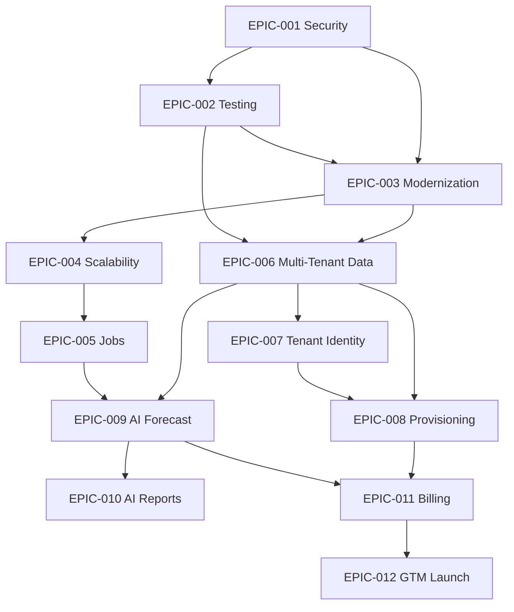

# Epic Catalog

**Product:** Arepomary SaaS  
**Version:** 1.0  
**Date:** June 19, 2026  
**Total Epics:** 12

---

## Epic Index

| ID | Epic | Phase | Priority | Est. (person-weeks) | Status |
|----|------|-------|----------|---------------------|--------|
| EPIC-001 | Platform Stabilization & Security | 1 | P0 | 8 | Not Started |
| EPIC-002 | Quality Engineering Foundation | 1 | P0 | 10 | Not Started |
| EPIC-003 | Codebase Modernization | 1 | P1 | 8 | Not Started |
| EPIC-004 | Performance & Scalability | 2 | P0 | 14 | Not Started |
| EPIC-005 | Background Operations & Jobs | 2 | P1 | 6 | Not Started |
| EPIC-006 | Multi-Tenant Data Model | 3 | P0 | 16 | Not Started |
| EPIC-007 | Tenant Identity & Routing | 3 | P0 | 10 | Not Started |
| EPIC-008 | Tenant Provisioning & White-Label | 3 | P0 | 12 | Not Started |
| EPIC-009 | AI Demand & Production Intelligence | 4 | P1 | 10 | Not Started |
| EPIC-010 | AI Reporting & Logistics Assist | 4 | P2 | 8 | Not Started |
| EPIC-011 | Commercial Billing & Self-Service | 5 | P0 | 12 | Not Started |
| EPIC-012 | Go-to-Market & Launch Operations | 5 | P0 | 8 | Not Started |

---

## EPIC-001: Platform Stabilization & Security

**Phase:** 1 — Stabilization  
**Priority:** P0  
**Estimate:** 8 person-weeks  
**Owner:** Engineering

### Description

Establish production-grade security baseline, secrets management, CI/CD pipeline, and observability before any SaaS transformation work.

### Business Value

Reduces operational and security risk for Arepomary production and creates the foundation for external tenant onboarding.

### Scope

- Secrets hygiene (`.env` gitignore, key rotation, Cloudflare secrets)
- GitLab CI: lint, typecheck, build, migration validation
- Sentry integration (client + SSR)
- Rate limiting on public order endpoints
- CAPTCHA on guest checkout
- Staging environment provisioning

### Acceptance Criteria

- [ ] No secrets in git history (post-rotation)
- [ ] CI pipeline green on every MR
- [ ] Sentry capturing errors in staging and production
- [ ] Public order endpoint rate-limited (configurable threshold)
- [ ] Staging environment mirrors production topology

### Dependencies

- Cloudflare account with Workers + secrets
- Supabase staging project
- GitLab CI runners

### Risks

| Risk | Mitigation |
|------|------------|
| Lovable regenerates integration files | Pin codegen; extract custom logic |
| Key rotation causes downtime | Staged rotation with dual-key window |

---

## EPIC-002: Quality Engineering Foundation

**Phase:** 1 — Stabilization  
**Priority:** P0  
**Estimate:** 10 person-weeks  
**Owner:** Engineering

### Description

Build automated test coverage for critical business paths and RLS policies to enable safe refactoring toward multi-tenant architecture.

### Business Value

Prevents regressions during the highest-risk phase (RLS rewrite) and reduces production incidents.

### Scope

- Vitest unit tests: RBAC, production-profit, export, phone validation
- Playwright E2E: login, guest order, order→sale, seller scoping
- Supabase RLS integration tests (local CLI)
- RPC contract tests for `create_guest_order`, `convert_order_to_sale`
- Test data seed scripts

### Acceptance Criteria

- [ ] ≥60% coverage on `src/lib/*`
- [ ] 8+ E2E smoke tests passing in CI
- [ ] RLS test suite covering admin, seller, customer, anon roles
- [ ] Zero P0 bugs in production for 30 days post-completion

### Dependencies

- EPIC-001 (CI pipeline)
- Supabase CLI for local testing

---

## EPIC-003: Codebase Modernization

**Phase:** 1 — Stabilization  
**Priority:** P1  
**Estimate:** 8 person-weeks  
**Owner:** Engineering

### Description

Refactor monolithic route files into maintainable feature modules with typed service layer; align RBAC with database roles.

### Business Value

Reduces development velocity drag and enables parallel team work on SaaS features.

### Scope

- Extract `src/services/` for orders, sales, customers, products
- Extract `src/features/` for top 5 largest routes
- Eliminate `as any` on critical RPC calls
- Add `production_operator` to frontend RBAC
- Fix customer login redirect (`/portal` not `/app`)
- Documentation: README, env setup, RPC catalog

### Acceptance Criteria

- [ ] No route file exceeds 300 LOC (top 5 refactored)
- [ ] Typed wrappers for all RPC functions
- [ ] `production_operator` role functional in UI
- [ ] Customer signup/login redirects to `/portal`
- [ ] README with local dev instructions

### Dependencies

- EPIC-002 (tests before refactor)

---

## EPIC-004: Performance & Scalability

**Phase:** 2 — Scalability  
**Priority:** P0  
**Estimate:** 14 person-weeks  
**Owner:** Engineering

### Description

Optimize application and database for 10× data growth: pagination, caching, query optimization, server-side exports.

### Business Value

Supports growing tenant operations without latency degradation or cost explosion.

### Scope

- Cursor pagination on all list views
- Dashboard KPI materialized views
- Cloudflare edge cache for public catalog
- Server-side PDF/Excel generation for large reports
- Supabase connection pooling
- Load testing (k6) with remediation
- React Query cache tuning

### Acceptance Criteria

- [ ] All ERP list views paginated (default 50 rows)
- [ ] Dashboard p95 load <2s with 100k sales records
- [ ] Public catalog cached at edge (TTL configurable)
- [ ] Load test: 100 concurrent ERP users without error rate >1%

### Dependencies

- EPIC-003 (service layer for pagination abstraction)
- EPIC-001 (staging environment)

---

## EPIC-005: Background Operations & Jobs

**Phase:** 2 — Scalability  
**Priority:** P1  
**Estimate:** 6 person-weeks  
**Owner:** Engineering

### Description

Introduce scheduled background jobs for operational alerts and async processing.

### Business Value

Proactive operations (low stock, overdue invoices) reduce manual monitoring and support scalable tenant count.

### Scope

- pg_cron or Cloudflare Worker cron setup
- Low stock alert job
- Overdue invoice detection job
- Scheduled report pre-generation
- Feature flag infrastructure

### Acceptance Criteria

- [ ] 3 scheduled jobs running in staging
- [ ] Alert notifications visible in ERP (in-app, not email v1)
- [ ] Feature flags controllable without deploy

### Dependencies

- EPIC-004 (optimized queries for job efficiency)

---

## EPIC-006: Multi-Tenant Data Model

**Phase:** 3 — Multi-Tenant  
**Priority:** P0  
**Estimate:** 16 person-weeks  
**Owner:** Engineering

### Description

Add `organization_id` to all business tables; rewrite RLS policies and RPC functions for tenant isolation.

### Business Value

**Core SaaS enabler** — without this, no external tenants can safely share infrastructure.

### Scope

- `organizations` and `organization_members` tables
- `organization_id` column on 30+ tables
- Rewrite all RLS policies with tenant scope
- Refactor all SECURITY DEFINER RPCs
- Cross-tenant isolation test suite
- Migrate Arepomary data to default organization
- External security audit

### Acceptance Criteria

- [ ] Zero cross-tenant data access in automated test suite
- [ ] All RPCs tenant-aware
- [ ] Arepomary production migrated without data loss
- [ ] External security audit passed

### Dependencies

- EPIC-002 (RLS test foundation)
- EPIC-003 (service layer)
- Legal review of data isolation requirements

### Risks

| Risk | Mitigation |
|------|------------|
| Cross-tenant data leak | Mandatory audit; defense-in-depth tests |
| Migration downtime | Blue-green migration; staging rehearsal |
| RPC/trigger breakage | Parallel validation; comprehensive test suite |

---

## EPIC-007: Tenant Identity & Routing

**Phase:** 3 — Multi-Tenant  
**Priority:** P0  
**Estimate:** 10 person-weeks  
**Owner:** Engineering

### Description

Implement tenant resolution (subdomain/path), JWT organization claims, and multi-org user support.

### Business Value

Enables branded tenant URLs and proper auth scoping for SaaS users.

### Scope

- Subdomain routing: `{slug}.arepomary.com`
- Tenant middleware in TanStack Start
- JWT `app_metadata.organization_id` on login
- Multi-org user membership and org switcher
- Platform super-admin role (suspend/activate tenants)

### Acceptance Criteria

- [ ] Tenant resolved from subdomain in <50ms
- [ ] JWT contains correct org claim after login
- [ ] User can belong to multiple orgs and switch
- [ ] Super-admin can suspend tenant (blocks all access)

### Dependencies

- EPIC-006 (org tables and RLS)
- DNS wildcard configuration

---

## EPIC-008: Tenant Provisioning & White-Label

**Phase:** 3 — Multi-Tenant  
**Priority:** P0  
**Estimate:** 12 person-weeks  
**Owner:** Product + Engineering

### Description

Automated tenant creation with defaults, configurable branding, and industry templates.

### Business Value

Self-service time-to-value; tenants operational in <1 hour without manual setup.

### Scope

- Provisioning API: org + default warehouse + settings + admin user
- Tenant branding: logo, colors, company name on landing/order/portal/ERP
- Industry template: "Food production & delivery" (products, cost categories)
- Configurable zones/neighborhoods (not hardcoded Fusagasugá)
- Onboarding wizard (Phase 5 extends this)

### Acceptance Criteria

- [ ] New tenant provisioned in <60 seconds
- [ ] Branding applied on all public pages
- [ ] Template seed creates usable starter catalog
- [ ] Zones/neighborhoods configurable per tenant

### Dependencies

- EPIC-006, EPIC-007

---

## EPIC-009: AI Demand & Production Intelligence

**Phase:** 4 — AI  
**Priority:** P1  
**Estimate:** 10 person-weeks  
**Owner:** Engineering + Product

### Description

AI-powered demand forecasting and production quantity suggestions based on historical order/sales data.

### Business Value

Key SaaS differentiator; reduces waste and stockouts for food producers.

### Scope

- AI service Worker with tenant isolation
- Weekly product demand forecast model
- Production suggestion widget on dashboard and `/app/production`
- Forecast cache (daily refresh via pg_cron)
- Usage metering hooks per tenant

### Acceptance Criteria

- [ ] Forecast displayed for all active products
- [ ] Production page shows suggested batch quantities
- [ ] AI cost <15% of target ARPU per tenant
- [ ] No cross-tenant data in AI prompts (verified)

### Dependencies

- EPIC-006 (tenant isolation mandatory)
- EPIC-005 (scheduled refresh)
- 6+ months historical data or synthetic seed

---

## EPIC-010: AI Reporting & Logistics Assist

**Phase:** 4 — AI  
**Priority:** P2  
**Estimate:** 8 person-weeks  
**Owner:** Engineering

### Description

Natural language report queries and logistics route grouping suggestions.

### Business Value

Reduces time-to-insight for non-technical users; improves delivery efficiency.

### Scope

- NL report chat panel in `/app/reports`
- Guardrailed SQL generation (allowlisted tables, read-only role)
- Shipment grouping suggestions in `/app/logistics`
- AI query audit log per tenant

### Acceptance Criteria

- [ ] 5 canonical report queries work via NL interface
- [ ] No SQL injection or cross-tenant leakage in pen test
- [ ] Logistics suggestions reduce manual grouping steps

### Dependencies

- EPIC-009 (AI service infrastructure)
- EPIC-006 (tenant isolation)

---

## EPIC-011: Commercial Billing & Self-Service

**Phase:** 5 — Commercial Launch  
**Priority:** P0  
**Estimate:** 12 person-weeks  
**Owner:** Product + Engineering

### Description

Stripe subscription billing, self-service signup, plan management, and usage-based overages.

### Business Value

Enables recurring revenue and self-service customer acquisition.

### Scope

- Stripe integration: products, prices, subscriptions, trials
- Webhook handlers: subscription lifecycle, dunning
- Marketing site with plan selection
- Self-service signup → payment → provisioning flow
- Billing portal (upgrade/downgrade/cancel)
- Usage metering display (seats, orders, AI queries)

### Acceptance Criteria

- [ ] End-to-end: signup → trial → paid conversion works
- [ ] Failed payment triggers grace period then suspension
- [ ] Billing portal accessible from ERP settings
- [ ] 3 pricing tiers configured in Stripe

### Dependencies

- EPIC-006, EPIC-007, EPIC-008
- Stripe account (Colombia availability validated)
- Legal: Terms of Service, Privacy Policy

---

## EPIC-012: Go-to-Market & Launch Operations

**Phase:** 5 — Commercial Launch  
**Priority:** P0  
**Estimate:** 8 person-weeks  
**Owner:** Product + Marketing

### Description

Launch infrastructure: support tooling, documentation, beta program, and GTM assets.

### Business Value

Converts product into market-ready SaaS with supportable customer experience.

### Scope

- Product marketing site (separate from tenant app)
- In-app help and documentation
- Support ticketing integration (Intercom/Crisp)
- Status page
- Beta program with 5 design partners
- Arepomary case study
- Launch campaign

### Acceptance Criteria

- [ ] Marketing site live with pricing and signup CTA
- [ ] Support SLA documented per tier
- [ ] 5 beta tenants onboarded with feedback incorporated
- [ ] 10 paying tenants within 90 days of launch

### Dependencies

- EPIC-011 (billing live)
- EPIC-009 or EPIC-010 (AI differentiator for Scale tier)

---

## Epic Dependency Graph

---

## Epic-to-Phase Mapping

| Phase | Epics | Calendar | Cumulative Effort |
|-------|-------|----------|-------------------|
| Phase 1 | EPIC-001, 002, 003 | Months 1–3 | ~26 pw |
| Phase 2 | EPIC-004, 005 | Months 3–6 | ~20 pw |
| Phase 3 | EPIC-006, 007, 008 | Months 6–10 | ~38 pw |
| Phase 4 | EPIC-009, 010 | Months 10–13 | ~18 pw |
| Phase 5 | EPIC-011, 012 | Months 13–15 | ~20 pw |
| **Total** | **12 epics** | **~15 months** | **~122 pw** |
