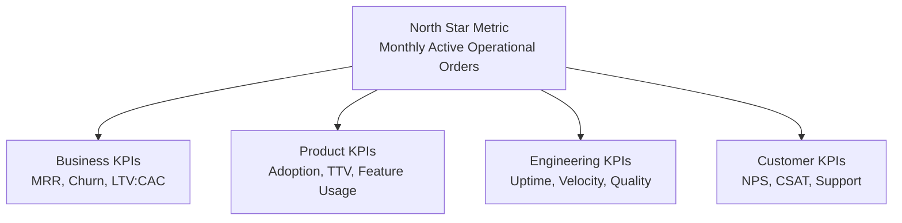

# KPI Framework

**Product:** Arepomary SaaS  
**Version:** 1.0  
**Date:** June 19, 2026

---

## 1. Purpose

This framework defines **measurable indicators** across business, product, engineering, and customer success dimensions. KPIs are tracked per roadmap phase and reported monthly post-launch.

---

## 2. KPI Hierarchy

---

## 3. North Star Metric

### Monthly Active Operational Orders (MAOO)

**Definition:** Total orders processed (guest + staff-created) across all active tenants in a calendar month, excluding cancelled and draft orders.

**Why:** Directly measures platform value delivery — every order represents a business transaction enabled by the platform. Correlates with tenant retention and revenue.

**Target trajectory:**

| Milestone | MAOO | Timeline |
|-----------|------|----------|
| Arepomary single tenant baseline | 500/month | Current |
| 5 beta tenants | 2,000/month | Phase 5 beta |
| 10 paying tenants | 5,000/month | Launch + 90 days |
| 50 paying tenants | 25,000/month | Launch + 12 months |

---

## 4. Business KPIs

### 4.1 Revenue

| KPI | Definition | Phase 5 Target | Frequency |
|-----|------------|----------------|-----------|
| **MRR** | Monthly Recurring Revenue (all tenants) | $5,000 USD | Monthly |
| **ARR** | MRR × 12 | $60,000 USD | Monthly |
| **ARPU** | Average Revenue Per User (tenant) | $149 USD (Growth avg) | Monthly |
| **Revenue per MAOO** | MRR / MAOO | Track trend | Monthly |
| **Trial-to-paid conversion** | Paid subscriptions / trial starts | >25% | Monthly |
| **Expansion revenue** | Upgrades + add-ons / total MRR | >10% | Monthly |

### 4.2 Growth

| KPI | Definition | Phase 5 Target | Frequency |
|-----|------------|----------------|-----------|
| **New tenants** | Tenants completing first paid month | 10 in first 90 days | Monthly |
| **Tenant growth rate** | (New - Churned) / Total | >10%/month early stage | Monthly |
| **Signup-to-provision rate** | Provisions / marketing signups | >80% | Weekly |
| **Onboarding completion** | Wizards completed / provisions | >70% | Weekly |
| **Time to first order** | Days from provision to first guest/staff order | <7 days | Per tenant |

### 4.3 Unit Economics

| KPI | Definition | Target | Frequency |
|-----|------------|--------|-----------|
| **CAC** | Sales + marketing spend / new tenants | <$500 USD | Quarterly |
| **LTV** | ARPU × avg tenant lifetime (months) | >$1,500 USD | Quarterly |
| **LTV:CAC** | LTV / CAC | >3:1 | Quarterly |
| **Payback period** | CAC / monthly ARPU | <6 months | Quarterly |
| **Gross margin** | (Revenue - infra costs) / Revenue | >70% | Monthly |
| **AI cost ratio** | AI API spend / MRR | <15% | Monthly |

### 4.4 Retention

| KPI | Definition | Target | Frequency |
|-----|------------|--------|-----------|
| **Logo churn** | Tenants cancelled / total tenants | <5%/month | Monthly |
| **Revenue churn (net)** | Lost MRR - expansion MRR / start MRR | <3%/month | Monthly |
| **Tenant lifetime** | Avg months before cancellation | >18 months | Quarterly |

---

## 5. Product KPIs

### 5.1 Adoption & Engagement

| KPI | Definition | Target | Frequency |
|-----|------------|--------|-----------|
| **DAU/MAU (staff)** | Daily active staff / monthly active staff | >40% | Weekly |
| **Modules activated** | Avg modules used per tenant (of available) | >5 | Monthly |
| **Guest order ratio** | Guest orders / total orders per tenant | Track per tenant | Monthly |
| **Order-to-sale conversion** | Sales with order_id / eligible orders | >60% | Monthly |
| **Portal adoption** | Customers with portal login / total customers | >20% | Monthly |

### 5.2 Feature Usage

| KPI | Definition | Target | Frequency |
|-----|------------|--------|-----------|
| **Production module usage** | Tenants with ≥1 batch/month | >50% of Growth+ | Monthly |
| **Logistics module usage** | Tenants with ≥1 shipment/week | >40% of Growth+ | Monthly |
| **Report exports** | PDF/Excel exports per tenant per month | >4 | Monthly |
| **AI forecast views** | Tenants viewing forecast / Scale tenants | >30% | Monthly |
| **NL report queries** | AI report queries per Scale tenant | >10/month | Monthly |
| **Commission payments** | Tenants using commission batch pay | >30% of Growth+ | Monthly |

### 5.3 Time-to-Value

| KPI | Definition | Target | Frequency |
|-----|------------|--------|-----------|
| **TTV (Time to Value)** | Hours from provision to first order processed | <24 hours | Per tenant |
| **Onboarding wizard completion** | Completed / started | >70% | Weekly |
| **Setup score** | % of recommended setup steps completed | >80% | Per tenant |
| **First-week retention** | Tenants active in week 2 / provisioned week 1 | >85% | Weekly |

### 5.4 Quality

| KPI | Definition | Target | Frequency |
|-----|------------|--------|-----------|
| **Order error rate** | Failed guest orders / attempts | <1% | Daily |
| **Data sync errors** | Inventory discrepancies detected | <0.5% | Weekly |
| **Conversion failures** | Failed order-to-sale / attempts | <0.1% | Weekly |

---

## 6. Engineering KPIs

### 6.1 Reliability

| KPI | Definition | Target | Frequency |
|-----|------------|--------|-----------|
| **Uptime** | Platform availability | 99.5% | Monthly |
| **Error rate (5xx)** | Server errors / total requests | <0.1% | Daily |
| **MTTR** | Mean time to resolve P0 incidents | <2 hours | Per incident |
| **P0 incidents** | Production-breaking issues | 0/month | Monthly |
| **Cross-tenant incidents** | Data isolation breaches | 0 ever | Continuous |

### 6.2 Performance

| KPI | Definition | Target | Frequency |
|-----|------------|--------|-----------|
| **Dashboard p95 latency** | 95th percentile load time | <2s | Daily |
| **API p95 latency** | Supabase RPC p95 | <500ms | Daily |
| **CI pipeline duration** | Lint + test + build | <10 min | Per run |
| **Deploy frequency** | Production deploys | ≥1/week | Weekly |
| **Change failure rate** | Deploys causing rollback | <5% | Monthly |

### 6.3 Quality

| KPI | Definition | Target | Frequency |
|-----|------------|--------|-----------|
| **Test coverage (lib)** | Line coverage on src/lib | ≥60% | Per MR |
| **E2E pass rate** | Smoke tests passing | 100% | Per run |
| **Bug escape rate** | Production bugs / total bugs | <10% | Monthly |
| **Technical debt ratio** | `as any` count + LOC >300 files | Decreasing | Monthly |

### 6.4 Velocity

| KPI | Definition | Target | Frequency |
|-----|------------|--------|-----------|
| **Sprint velocity** | Story points completed / sprint | ~20 (2 engineers) | Per sprint |
| **Lead time** | Story created → production | <2 sprints | Per story |
| **MR cycle time** | MR opened → merged | <2 days | Weekly |

---

## 7. Customer Success KPIs

| KPI | Definition | Target | Frequency |
|-----|------------|--------|-----------|
| **NPS** | Net Promoter Score | >40 | Quarterly |
| **CSAT** | Support satisfaction rating | >4.2/5 | Per ticket |
| **Support ticket volume** | Tickets per tenant per month | <2 (Starter), <5 (Growth) | Monthly |
| **First response time** | Time to first support reply | <4 hours (Growth), <1 hour (Scale) | Per ticket |
| **Resolution time** | Time to close ticket | <24 hours | Per ticket |
| **Health score** | Composite: usage + payments + support | >70/100 avg | Monthly |
| **At-risk tenants** | Health score <40 | <10% of base | Monthly |
| **Case study count** | Published customer stories | ≥3 by launch + 6mo | Quarterly |

---

## 8. SaaS Platform KPIs (Post Multi-Tenant)

| KPI | Definition | Target | Frequency |
|-----|------------|--------|-----------|
| **Active tenants** | Tenants with ≥1 order in last 30 days | Track growth | Monthly |
| **Tenant density** | Tenants per Supabase project | 100+ | Phase 3 |
| **Provisioning success rate** | Successful provisions / attempts | >99% | Daily |
| **Provisioning duration** | Time to complete tenant setup | <60s (p95) | Daily |
| **Suspended tenants** | Tenants suspended for non-payment | <5% | Monthly |
| **Storage per tenant** | Avg storage used | <500 MB | Monthly |
| **DB queries per tenant** | Avg daily queries | Monitor trend | Daily |

---

## 9. Phase-Specific KPI Targets

### Phase 1 — Stabilization (Months 1–3)

| KPI | Target |
|-----|--------|
| CI pipeline operational | Yes |
| E2E tests passing | 8+ |
| P0 production bugs | 0 |
| Error monitoring live | Yes |
| Test coverage (lib) | ≥60% |

### Phase 2 — Scalability (Months 3–6)

| KPI | Target |
|-----|--------|
| Dashboard p95 | <2s at 100k sales |
| All lists paginated | 100% |
| Load test concurrent users | 100 |
| Low stock alerts active | Yes |

### Phase 3 — Multi-Tenant (Months 6–10)

| KPI | Target |
|-----|--------|
| Cross-tenant incidents | 0 |
| Pilot tenants live | 3 |
| Provisioning duration p95 | <60s |
| Security audit | Passed |

### Phase 4 — AI (Months 10–13)

| KPI | Target |
|-----|--------|
| Forecast adoption | >30% Scale tenants |
| AI cost / ARPU | <15% |
| NL report queries / tenant | >10/month |

### Phase 5 — Commercial Launch (Months 13–15)

| KPI | Target |
|-----|--------|
| Paying tenants | 10 |
| MRR | $5,000 USD |
| Trial-to-paid | >25% |
| NPS | >40 |
| Uptime (30-day pre-launch) | 99.5% |
| Monthly churn | <5% |

---

## 10. KPI Dashboard Structure

### Executive Dashboard (Monthly)

| Section | KPIs |
|---------|------|
| Revenue | MRR, ARR, ARPU, trial conversion |
| Growth | New tenants, MAOO, growth rate |
| Retention | Logo churn, revenue churn, NPS |
| Unit economics | LTV:CAC, gross margin, AI cost ratio |

### Product Dashboard (Weekly)

| Section | KPIs |
|---------|------|
| Engagement | DAU/MAU, modules activated, TTV |
| Feature usage | Production, logistics, AI, reports |
| Quality | Order error rate, conversion failures |
| Onboarding | Wizard completion, setup score |

### Engineering Dashboard (Daily)

| Section | KPIs |
|---------|------|
| Reliability | Uptime, error rate, P0 incidents |
| Performance | p95 latency (dashboard, API) |
| Delivery | Deploy frequency, CI duration, velocity |
| Quality | Test pass rate, bug escape rate |

---

## 11. KPI Collection & Tooling

| KPI Category | Data Source | Tool |
|--------------|-------------|------|
| Revenue | Stripe | Stripe Dashboard + webhook events |
| MAOO / orders | Supabase | SQL query / materialized view |
| Engagement | App events | PostHog or Supabase analytics (TBD) |
| Performance | Cloudflare + Supabase | CF Analytics, Supabase logs |
| Errors | Application | Sentry |
| Support | Ticketing | Intercom/Crisp |
| NPS | Surveys | In-app quarterly prompt |
| Infrastructure cost | Billing | Cloudflare + Supabase + LLM invoices |

---

## 12. KPI Review Cadence

| Cadence | Audience | KPIs Reviewed |
|---------|----------|---------------|
| Daily | Engineering | Error rate, latency, deploy status |
| Weekly | Product + Engineering | Engagement, feature usage, velocity, onboarding |
| Monthly | Leadership | MRR, churn, MAOO, tenant growth, unit economics |
| Quarterly | Board/Investors | ARR, LTV:CAC, NPS, strategic milestones |

---

## 13. Anti-Metrics (What NOT to Optimize)

| Anti-Metric | Why Avoid |
|-------------|-----------|
| Total registered users (without activation) | Vanity metric; doesn't reflect value |
| Lines of code | More code ≠ more value |
| Features shipped (without adoption) | Feature factory trap |
| Page views | Doesn't correlate with operational orders |
| AI queries (without accuracy) | Quantity without quality misleads |

---

## 14. KPI → Epic Traceability

| KPI | Driving Epic | Key Feature |
|-----|-------------|-------------|
| MAOO | EPIC-008 | Tenant provisioning + onboarding |
| MRR | EPIC-011 | Stripe billing |
| Trial conversion | EPIC-011, EPIC-008 | Self-service + wizard |
| Cross-tenant incidents | EPIC-006 | RLS rewrite |
| Dashboard p95 | EPIC-004 | Materialized views |
| AI adoption | EPIC-009 | Demand forecast |
| NPS | EPIC-012 | Support + GTM |
| Test coverage | EPIC-002 | Quality engineering |
